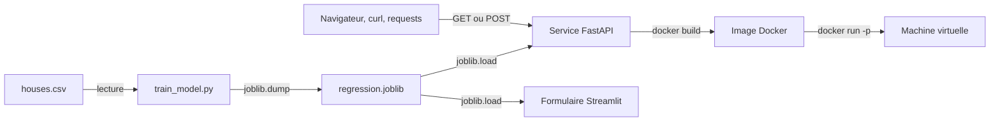

# Prédiction du prix des maisons, en production

Un modèle de régression linéaire sorti du notebook et mis en ligne par paliers :
d'abord un service web en local, puis le même service dans un conteneur, puis le
conteneur sur une machine distante.

Mini projet du module *Machine learning in production I: embedding a model in a
backend*, M2 Data Engineering & IA, EFREI.

| | |
|---|---|
| Auteur | Adam BELOUCIF ([Adam-Blf](https://github.com/Adam-Blf)) |
| Modèle | régression linéaire scikit-learn, entraînée sur `houses.csv` |
| Service | FastAPI, servi par Uvicorn |

## Architecture



Le modèle est entraîné une fois, puis relu par deux programmes séparés : l'API
et le formulaire Streamlit. Comme ils ouvrent le même `regression.joblib`, ils
ne peuvent pas annoncer deux prix différents pour la même maison.

## Démarrage rapide

Les dépendances s'installent avec [uv](https://docs.astral.sh/uv/).

```bash
uv venv .venv
VIRTUAL_ENV=.venv uv pip install -r requirements-dev.txt

# Entraîne le modèle et écrit regression.joblib
.venv/Scripts/python train_model.py      # Windows
# .venv/bin/python train_model.py        # Linux et macOS

# Démarre le service
.venv/Scripts/python -m uvicorn app.main:app --reload --port 8000
```

Une fois le service lancé, la documentation générée par FastAPI est sur
[http://127.0.0.1:8000/docs](http://127.0.0.1:8000/docs).

## Points d'entrée

| Méthode | Chemin | Rôle |
|---|---|---|
| `GET` | `/health` | Sonde de vie. Ne charge pas le modèle. |
| `GET` | `/predict` | Prédiction depuis des paramètres d'URL. |
| `POST` | `/predict` | Prédiction depuis un corps JSON. |

Trois caractéristiques en entrée : `size` la surface habitable en mètres carrés,
`nb_rooms` le nombre de chambres, `garden` la présence d'un jardin, 0 ou 1.

```bash
# Depuis l'URL, ce qui marche aussi dans un navigateur
curl "http://127.0.0.1:8000/predict?size=120&nb_rooms=3&garden=1"

# Depuis un corps JSON
curl -X POST http://127.0.0.1:8000/predict \
  -H "Content-Type: application/json" \
  -d '{"size": 120, "nb_rooms": 3, "garden": 1}'
```

Les deux verbes rendent la même chose :

```json
{"y_pred": 289962.4945993448}
```

Pydantic refuse en `422` tout ce qui sort des bornes, une surface négative ou un
jardin qui vaudrait 2, et la requête n'atteint jamais le modèle. Si le service
démarre sans `regression.joblib`, il répond `503`. Il n'est pas prêt, ce qui
n'est pas la même chose qu'être cassé.

### Depuis Python

```python
import requests

reponse = requests.post(
    "http://127.0.0.1:8000/predict",
    json={"size": 120, "nb_rooms": 3, "garden": 1},
)
print(reponse.json()["y_pred"])
```

## Tests

```bash
.venv/Scripts/python -m pytest tests -q
```

Sept tests. La plupart contrôlent la plomberie HTTP, mais l'un vérifie que le
prix monte quand la surface monte. Sans lui, la suite resterait verte avec les
colonnes du modèle branchées à l'envers.

## Docker

```bash
docker build -t house-price-api:1.0.0 .
docker run -d --name house-price-api -p 8008:8000 house-price-api:1.0.0

curl "http://127.0.0.1:8008/predict?size=120&nb_rooms=3&garden=1"
```

Sans `-p`, le service écoute à l'intérieur du conteneur et personne ne le voit
depuis la machine hôte.

L'image se construit en deux étages. Le premier installe les dépendances avec
`uv` et entraîne le modèle, le second ne récupère que l'environnement virtuel,
le modèle et le code. Ni `uv`, ni `houses.csv`, ni le cache d'installation ne
partent en production, et le service tourne en utilisateur non privilégié.

## Formulaire Streamlit

```bash
.venv/Scripts/python -m streamlit run model_app.py
```

Trois champs `st.number_input`, un bouton, le prix affiché par `st.write`. Même
modèle que l'API.

## Déploiement sur la machine distante

Le service tourne sur la machine virtuelle fournie, dans
`/home/ubuntu/Adam-Beloucif`, publié sur le port `8084`.

Le sujet demande un dossier par personne, nommé d'après le nom ou les initiales.
J'ai pris le nom complet : la machine est partagée par toute la promotion, deux
étudiants peuvent avoir les mêmes initiales, et un dossier `AB` s'y trouvait
déjà avant moi.

```bash
ssh ubuntu@<adresse-de-la-vm>
mkdir -p /home/ubuntu/Adam-Beloucif && cd /home/ubuntu/Adam-Beloucif
git clone https://github.com/Adam-Blf/house-price-api.git .
```

### Sans conteneur

```bash
uv venv .venv
VIRTUAL_ENV=.venv uv pip install -r requirements.txt
.venv/bin/python train_model.py
.venv/bin/python -m uvicorn app.main:app --host 0.0.0.0 --port 8084
```

Le défaut d'Uvicorn est `127.0.0.1`, c'est-à-dire la boucle locale de la machine
virtuelle. Avec ça le service ne sort pas de la machine, d'où `--host 0.0.0.0`.

### Avec conteneur

```bash
docker build -t house-price-api:1.0.0 .
docker run -d --name adam-beloucif-mlws --restart unless-stopped \
  -p 8084:8000 house-price-api:1.0.0
```

`--restart unless-stopped` évite d'avoir à relancer à la main après un
redémarrage de la machine virtuelle.

### Vérification depuis une autre machine

```bash
curl "http://<adresse-de-la-vm>:8084/predict?size=120&nb_rooms=3&garden=1"
# {"y_pred":289962.4945993448}
```

Testé depuis un poste extérieur : `/health`, `/predict` en GET et en POST, le
refus en `422`, et `/docs`. Les prix sont au centime près ceux obtenus en local,
donc c'est bien le même modèle qui répond.

Attention, tous les ports ne sortent pas de la machine. `8085` et `8090` sont
filtrés en entrée alors que `8084` passe. Un service qui répond en local et
reste muet depuis l'extérieur, c'est le pare-feu, pas le code.

Les identifiants de connexion sont donnés en séance. Ils ne sont écrits nulle
part dans ce dépôt, et n'ont rien à y faire.

## Structure du projet

```
.
├── app/
│   ├── main.py            # points d'entrée FastAPI
│   ├── model.py           # chargement du modèle et prédiction
│   └── schemas.py         # validation des entrées et sorties
├── tests/
│   └── test_api.py        # sept tests du service
├── houses.csv             # jeu de données fourni
├── train_model.py         # script d'entraînement fourni
├── model_app.py           # formulaire Streamlit
├── Dockerfile             # image en deux étages
├── requirements.txt       # dépendances d'exécution
└── requirements-dev.txt   # dépendances de développement
```

`regression.joblib` n'est pas versionné. `train_model.py` le régénère en une
commande, et un binaire dans l'historique se mettrait à mentir dès qu'on
toucherait au jeu de données.

## Choix techniques

Le modèle est lu une fois au premier appel, puis gardé en mémoire. Le recharger
à chaque requête, ce serait une lecture disque par prédiction.

Les caractéristiques passent dans un `DataFrame` avec les noms de colonnes,
jamais dans un tableau brut. C'est le piège le plus sournois du projet :
scikit-learn accepte un tableau sans noms et se contente d'un avertissement,
donc une inversion de colonnes ne casse rien. Elle rend seulement des prix faux
et parfaitement plausibles.

`uvicorn[standard]` tire `uvloop` et `httptools`, la boucle d'évènements et
l'analyseur HTTP écrits en C.

Le modèle est entraîné pendant la construction de l'image, pas au démarrage du
conteneur. Un conteneur qui s'entraîne au lancement repaie ce coût à chaque
redémarrage, et peut échouer en production sur un fichier de données absent.
